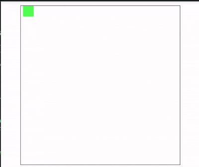

# svgpen

## Canvas-like API for SVG.



svgpen offers HTML5 Canvas features but with SVG. It extends the functionality of SVGs by making them easily "programmable", wihout having to declare `document.createElementNS` everytime.

### Install

```bash
npm i @js_cipher/svgpen
```

### Quick Start
Create a root element in your HTML.
```html
<div id="root" width="400" height="300"></div>
```

```javascript
import { SVGRoot } from '@js_cipher/svgpen';

const svg = new SVGRoot(root, 300, 300); // root element, width, height, backgroundColor?

svg.fillRect(10, 10, 100, 50, 'red', 'black'); // x, y, w, h, fill, stroke
svg.fillEllipse(200, 50, 40, 20, '#3b82f6'); // cx, cy, rx, ry, fill
svg.fillText('Hello SVG', 10, 120, '#111', 16); // text, x, y, fill, fontSize
```

### API

All methods return the created SVG element so you can chain or modify it.
- `new SVG(root, w, h)`	`SVGSVGElement`	Create your `<svg>` node
- `fillRect(x, y, w, h, fill?, stroke?)` Draws `<rect>`
- `fillCircle(cx, cy, r, fill?, stroke?)` Draws `<ellipse>`
- `plotLine(x1, y1, x2, y2, stroke, strokeWidth?` Draws `<line>`
- `polygon(points, fill?, stroke?, strokeWidth?)` `points="x1,y1 x2,y2"` Draws `<polygon>`
- `path(d, fill?, stroke?, strokeWidth?)` SVG path `d` -> Raw SVG path `d` attribute 
- `renderText(text, x, y, fill?, fontSize?)` Draws `<text>`
- Other methods: fillEllipse, polyline
- `fill` and `stroke` default to `none` and `black` if you skip them.

### updateCanvas
The `updateCanvas(element, attribute, newValue)` method updates the `SVG` element, adding a layer of functionality on top of it, it can be used togther with `window.requestAnimationFrame` to render smooth animations.

```javascript
const rect = svg.fillRect(0, 0, 20, 20, "#50FF50");

let dx = 0;

function animate() {
    dx += 1;
    
    svg.updateCanvas(rect, "x", dx);
    window.requestAnimationFrame(animate);
}

window.requestAnimationFrame(animate);
```

Unlike the HTML5 canvas that clears the canvas and redraws, svgpen updates the `SVG` element's attributes in real-time without needing a redraw.

### Why use this vs raw SVG?

1. *Canvas API feel*: Less verbose than `createElementNS` every time.
2. *Real DOM*: You still get `<svg>` you can style, animate with CSS, or export.
3. *Tiny*: Zero deps. Tree-shakeable ESM + UMD build included.
4. *Programmability*: svgpen helps you abstract all the raw SVG with JavaScript, allowing you focus on the logic.

### Roadmap / TODO
- More SVG elements and attributes
- Path builder helpers
- TypeScript types

PRs are welcome.

### License
MIT